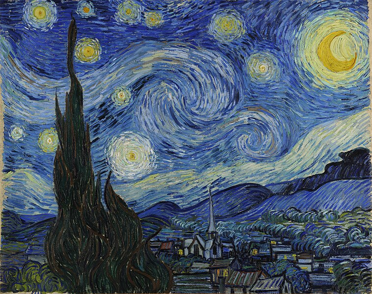

# Style Transfer Using VGG19

This project demonstrates the application of neural style transfer using the VGG-19 model pre-trained on the ImageNet dataset. The system blends the content structure of a photograph with the artistic style of a separate artwork image to generate a new stylized output.

## Methodology

1. **Model**: VGG-19, pre-trained on ImageNet, is used for feature extraction.
2. **Input**: Two images are required:
   - A content image that provides the structural elements.
   - A style image that provides the stylistic patterns.
3. **Loss Functions**:
   - **Content Loss**: Measures the difference in content features between the output and content images.
   - **Style Loss**: Measures the difference in style features (via Gram matrix) between the output and style images.
   - **Total Loss**: Weighted combination of content and style losses.
4. **Optimization**: L-BFGS optimizer iteratively updates the output image pixels to minimize total loss.

## Results

The output image successfully preserves the structural content of the content image while adopting the artistic style of the style image. Below are visualizations of the loss trends during optimization:

### Loss Plots
| Loss Type       | Visualization                       |
|------------------|-------------------------------------|
| **Content Loss** |   |
| **Style Loss**   |       |
| **Total Loss**   |       |

> **Note**: Place the loss images in a folder named `images` for correct rendering.

## Example

| Input Content Image | Input Style Image | Output Stylized Image |
|----------------------|-------------------|------------------------|
|  |  |  |

> **Note**: Place the example images in the `images` folder as well.

## How to Run

1. Clone this repository:
   ```bash
   git clone https://github.com/lechianh12/Style-Transfer-VGG19.git
   cd Style-Transfer-VGG19
